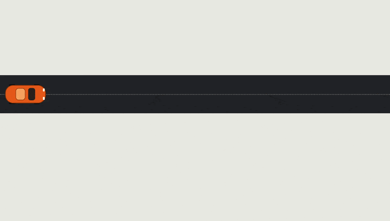

# Scroll-driven hero

A pinned hero where a top-down car drives across the screen as you scroll, revealing the headline and four stats as it passes them.

**Live:** https://2905harsh.github.io/scroll-car-hero/



**Stack:** Next.js (static export), React, Tailwind CSS, GSAP + ScrollTrigger. Fonts are self-hosted through Fontsource.

## Run locally

```bash
npm install
npm run dev
```

Pushes to `main` deploy automatically to GitHub Pages via GitHub Actions (`.github/workflows/deploy.yml`).

## Requirements covered

| Requirement | Where |
|---|---|
| Letter-spaced headline and stats above the fold | `components/Hero.tsx` |
| Load animation | The road draws in and the car fades up (`playIntro` in the hook) |
| Scroll-linked motion with easing | Pinned ScrollTrigger timeline with `scrub: 1` |
| Transforms only | `x`, `y`, `scale`, `opacity`; no layout properties are animated |
| No layout work on scroll | Positions are measured once per build, not in a scroll handler |
| GSAP, Next.js, Tailwind | `gsap`, `next` (static export), `tailwindcss` |
| Hosted on GitHub Pages | `.github/workflows/deploy.yml` |

## How the scroll logic works

All of it lives in `hooks/useHeroAnimation.ts`.

- **One pinned timeline.** ScrollTrigger pins the hero and maps scroll distance to timeline progress (0 to 1) with `scrub: 1`, which adds the smoothing.
- **The car owns the clock.** Its `x` tween spans the whole timeline with `ease: "none"`, so progress equals position.
- **Reveals follow the car.** Each letter and stat is measured once, then placed on the timeline at the progress where the car's nose reaches it. Letters rise and fade in. Stats rise, fade in, and count up from 0.
- **Clean first frame.** Nothing reveals until the car actually moves, so the page opens on the car and the road only. This is by design: the headline and stats are revealed by the car on scroll.
- **Load intro.** The road draws in, then the car fades up onto it. This plays once.
- **Performance.** Only `x`, `y`, `scale`, and `opacity` are animated. Layout is measured once per build, never inside the scroll handler.
- **Resize.** Positions are measured from the DOM, so the timeline is rebuilt (debounced) when the width changes. Mobile address-bar resizes are ignored.
- **Reduced motion.** With `prefers-reduced-motion`, the final state renders with no animation.

## Structure

```
app/            layout, page, global styles
components/     Hero, Car (SVG)
hooks/          useHeroAnimation (all scroll logic)
lib/gsap.ts     one-time plugin registration
```

## Tuning

Constants at the top of the hook: `PAD`, `REVEAL`, `GHOST`, `SCROLL_LENGTH`. Set `GHOST` to `0.12` to show a faint headline and stats on load.